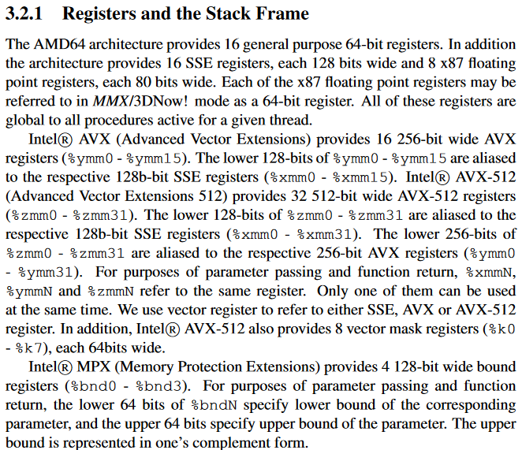
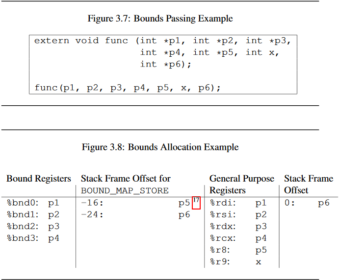

# AMD64位汇编参数传递

x86-64处理器的16个通用寄存器

|寄存器名|寄存器简介|主要功能|63-0|31-0|15-0|8-0|
|:--------:|:----------:|:----------:|:----------:|:----------:|:----------:|:----------:|
|rax|累加器，是算术运算的主要寄存器|存储第一个返回值|rax|eax|ax|al|
|rbx|基址寄存器，被调用者保存|存放存储区的起始地址|rbx|ebx|bx|bl|
|rcx|计数寄存器|循环操作和字串处理的计数控制；函数调用时的第4个参数|rcx|ecx|cx|cl|
|rdx|I/O指针|I/O操作时提供外部设备接口的端口地址；函数调用时的第3个参数;存储第二个返回值|rdx|edx|dx|dl|
|rsi|(source index)源变址寄存器，与rds段寄存器联用，可以访问数据段中的任一个存储单元|函数调用时的第2个参数|rsi|esi|si|sil|
|rdi|(destination index)目的变址寄存器，与res段寄存器联用，可以访问附加段中的任一个存储单元|函数调用时的第1个参数|rdi|edi|di|dil|
|rbp|(base pointer)基址指针寄存器，用于提供堆栈内某个单元的偏移地址，与rss段寄存器联用，可以访问堆栈中的任一个存储单元，被调用者保存| |rbp|ebp|bp|bpl|
|rsp|(stack pointer)栈顶指针寄存器，提供堆栈栈顶单元的偏移地址，与rss段寄存器联用，以控制数据进栈和出栈| |rsp|esp|sp|spl|
|r8|函数调用时的第5个参数||r8|r8d|r8w|r8b|
|r9|函数调用时的第6个参数||r9|r9d|r9w|r9b|
|r10|调用者保存||r10|r10d|r10w|r10b|
|r11|调用者保存||r11|r11d|r11w|r11b|
|r12|被调用者保存||r12|r12d|r12w|r12b|
|r13|被调用者保存||r13|r13d|r13w|r13b|
|r14|被调用者保存||r14|r14d|r14w|r14b|
|r15|被调用者保存||r15|r15d|r15w|r15b|

段寄存器  
CS(code segment)
代码段地址寄存器，存放代码段的起始地址  
DS(data segment)
数据段地址寄存器，存放数据段的起始地址  
SS(stack segment)
堆栈段地址寄存器，存放堆栈段的起始地址  
ES(extra segment)
附加段地址寄存器，存放附加段的起始地址  
FS/GS (16位) 数据相关寄存器，通常用在操作系统中
在32/64位系统中，应用程序内存模型通常是平坦模式。此时，段寄存器不再指向段地址，而是作为全局段描述符表的一个索引，索引对应的项数据存放了基址地址，在平坦模式中，这些基址都相同。并且基址为0,此时，偏移地址就和程序可见的线性空间地址一致。具体参阅GDTR/LDTR相关资料。

控制寄存器  
IP(Instruction Pointer):指令指针寄存器，存放代码段中指令的偏移地址。  
FR(Flags Register):标志寄存器，用于存放反映处理器和运行程序执行结果状态的控制标志和条件码标志。

**通用寄存器特性要点：**  
1）常用寄存器有16个，分为x86通用寄存器以及r8-r15寄存器。  
2）通用寄存器中，函数执行前后必须保持原始的寄存器有3个：是rbx、rbp、rsp。rx寄存器中，最后4个必须保持原值：r12、r13、r14、r15。保持原值的意义是为了让当前函数有可信任的寄存器，减小在函数调用过程中的保存&恢复操作。除了rbp、rsp用于特定用途外，其余5个寄存器可随意使用。  
3）通用寄存器中，不必假设保存值可随意使用的寄存器有5个：是rax、rcx、rdx、rdi、rsi。其中rax用于第一个返回寄存器（当然也可以用于累加等其它用途），rdx可用于第二个返回寄存器（在调用函数时也可用于第三个参数寄存器），rcx可用于第四个参数，rdi可用于第一个参数，rsi可用于第二个函数参数。  
4）r8、r9分配可用于第5、第6个参数。

###在CTF中，一般使用整数和指针进行传递参数。在输入参数为整数或指针时，将按照下面形式传递参数：
**If the class is** ***INTEGER or POINTER*** **, the next available register of the sequence %rdi,%rsi,%rdx,%rcx,%r8 and %r9 is used。Once registers are assigned, the arguments passed in memory are pushed on the stack in reversed (right-to-left) order.**  
可以解释为：
**H(a, b, c, d, e, f, g, h);
a->%rdi, b->%rsi, c->%rdx, d->%rcx, e->%r8, f->%r9
h->8(%esp)
g->(%esp)
call H**
###如果涉及到浮点数，将会使用%xmm0-%xmm7，更多细节可以参见ABI： [System V Application Binary Interface AMD64 Architecture Processor Supplement](https://software.intel.com/sites/default/files/article/402129/mpx-linux64-abi.pdf)
###下面4张图来自上述ABI： 
**更详尽的寄存器信息:**  

**栈帧结构**  

**示例1**  

**示例2**  

**补充1**:寄存器间接寻址方式（寄存器在括号里）  
MOV BX,[DI]  
操作数的有效地址用SI、DI、BX和BP等四个寄存器之一来指定，称这种寻址方式为寄存器间接寻址方式。  
若有效地址用SI、DI和BX来指定，则其缺省的段寄存器为DS；  
**若有效地址用BP来指定，则其缺省的段寄存器为SS(即：堆栈段)**。